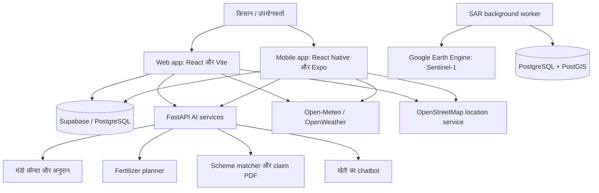
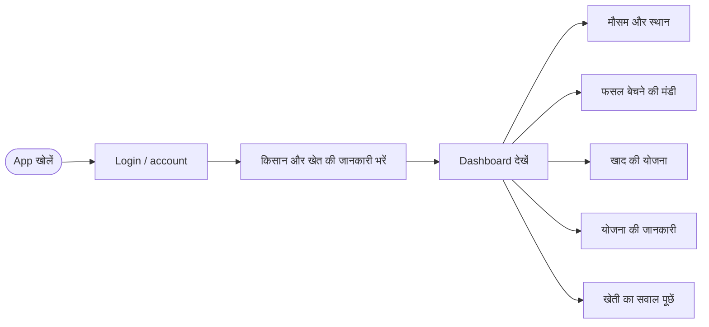
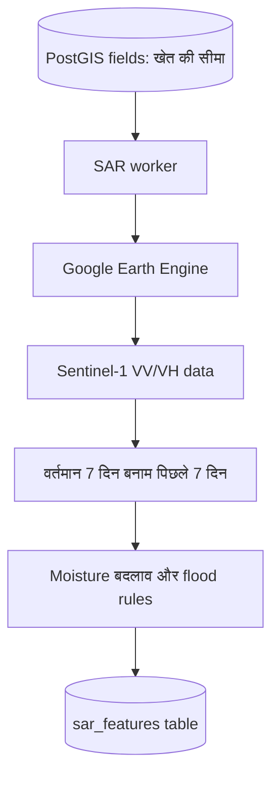

# Crop-Wise Project Summary (सरल हिंदी में)

यह दस्तावेज़ Crop-Wise project को आसान भाषा में समझाता है—यह किसके लिए है, इसके कौन-कौन से भाग हैं, वे कैसे काम करते हैं, और इसे चलाने के लिए क्या चाहिए। इसमें वही बातें शामिल हैं जो repository के code में मिली हैं; जहाँ कोई feature सीमित, optional या अभी पूरी तरह production-ready नहीं है, वहाँ साफ़ बताया गया है।

## 1. एक नज़र में

**Crop-Wise** किसानों और project पर काम करने वाले लोगों के लिए एक agriculture सहायता platform है। इसका मुख्य web app किसान को मौसम, फसल बेचने की जगह, खाद की योजना और सरकारी योजनाओं की जानकारी देता है। साथ में mobile app, खेती से जुड़े सवालों का chatbot और खेत की satellite (SAR) जानकारी लेने वाला अलग processing program भी है।

सरल शब्दों में:

> किसान अपनी जानकारी देता है → app उपलब्ध मौसम और खेती के data को लेता है → अलग-अलग services सलाह तैयार करती हैं → सलाह dashboard पर दिखाई जाती है।

यह app सलाह और जानकारी देता है। यह सरकारी योजना में अपने-आप आवेदन नहीं करता, claim मंज़ूर नहीं करता और किसी सलाह को official सरकारी निर्णय नहीं बनाता।

## 2. पूरे project का नक्शा



**ध्यान दें:** Web और mobile कुछ सुविधाएँ सीधे Supabase या मौसम/location APIs से लेते हैं। मंडी, fertilizer, schemes और chatbot के लिए backend service की जरूरत पड़ती है। SAR worker अलग से चलने वाला optional data-processing हिस्सा है।

## 3. उपयोगकर्ता का सामान्य flow



किसान का profile/location हर feature में समान रूप से इस्तेमाल होगा या नहीं, यह अलग-अलग feature की implementation और भरी गई जानकारी पर निर्भर है। कुछ APIs को फसल, जमीन, जिला या location अलग से देना पड़ सकता है।

## 4. Project के मुख्य हिस्से

### A. Web application

**जगह:** `client/`

- React 18 और Vite से बना browser में चलने वाला app।
- मुख्य रास्ता: login → registration → dashboard।
- Dashboard में overview, weather, mandi, advisory, fertilizer, schemes, alerts और calendar जैसे sections/tabs हैं।
- Login के बाद farmer/farm की जानकारी registration में भरी जा सकती है।
- Registered उपयोगकर्ता के लिए Kisan Mitra chatbot का widget भी है।
- Web में Google translation के widget/API का code है; translation के लिए network और configuration/provider उपलब्ध होना जरूरी है।

मुख्य code: `client/src/App.jsx`, `client/src/pages/`, `client/src/components/`, `client/src/lib/`।

### B. Mobile application

**जगह:** `mobile/`

- React Native और Expo आधारित app।
- इसमें login/account, registration और dashboard screens हैं।
- Mobile dashboard में मौसम और mandi से जुड़ी सुविधा मौजूद है।
- Web app के मुकाबले mobile version में सभी sections समान रूप से नहीं हैं: source में fertilizer, schemes, chatbot और translation के dedicated mobile screens नहीं मिले।
- Location सुविधा के लिए device location permission मांगी जा सकती है।

मुख्य code: `mobile/App.js`, `mobile/src/screens/`, `mobile/src/navigation/`, `mobile/src/lib/`।

### C. Login और किसान का profile

- Web और mobile दोनों में Supabase client का उपयोग है।
- Farmer की login/profile और खेत की registration जानकारी से जुड़े code मौजूद हैं।
- Database का शुरुआती schema `docs/registration-table.sql` में है; उसमें `farmers` और `registrations` tables तथा Row Level Security policies शामिल हैं।
- Login/session का सटीक तरीका web और mobile implementation में अलग-अलग हो सकता है। अपना project चलाते समय Supabase project, database schema और सही environment values देना जरूरी है।
- `.env.sample` और `.env.example` में खाली/example values हैं। असली credentials केवल अपनी local `.env` में रखें; उसे GitHub पर upload न करें।

### D. मौसम (Weather)

**मुख्य code:** `client/src/lib/farmWeather.js`, `mobile/src/lib/farmWeather.js`

- App खेत/गाँव का स्थान और coordinates खोजने की कोशिश करता है।
- Open-Meteo से मौसम forecast और air quality ली जा सकती है; इस रास्ते में सामान्यतः API key की जरूरत नहीं होती।
- OpenStreetMap के Nominatim का उपयोग geocoding/reverse geocoding के लिए हो सकता है।
- वैकल्पिक OpenWeatherMap configuration भी मौजूद है; सही key न होने पर उस provider की सुविधा उपलब्ध नहीं होगी।
- मौसम का सही परिणाम internet, सही location और बाहरी provider की availability पर निर्भर करता है।

### E. मंडी सलाह (Mandi Intelligence)

**मुख्य code:** `AIML/mandi_intelligence/`

- किसान crop, quantity और location/coordinates जैसी जानकारी देता है।
- Service उपलब्ध mandis और price data देखती है।
- Code historical/local CSV data से mandi/crop के हिसाब से price prediction model चलाता है; model files `ml_arbitrage/models/` में हैं।
- अनुमानित कमाई में दूरी/transport, storage, crop खराब होने की संभावना (perishability) और traffic जैसे खर्च घटाकर mandi rank की जाती है।
- यह **live mandi feed होने की गारंटी नहीं है**: repository में dataset file मौजूद है, लेकिन उससे अपने-आप real-time AGMARKNET connection सिद्ध नहीं होता।
- Forecast/model उपलब्ध न होने पर अनुमान सीमित हो सकता है; इसे बाजार भाव की पक्की गारंटी न मानें।

### F. खाद की योजना (Fertilizer Plan)

**मुख्य code:** `client/src/components/FertilizerAdvisor.jsx`, `AIML/ml/fertilizer_router.py`

- Crop, season, खेत का area/land size और district जैसे inputs लेकर urea, DAP और MOP की अनुमानित मात्रा/समय-सारणी बताता है।
- Server-side calculation में crop के base NPK rates, Gujarat district CSV में दी मिट्टी/pH/irrigation जानकारी, तथा उपलब्ध NDVI और rainfall जैसे inputs शामिल होते हैं।
- यह code आधारित **rule/formula वाला planner** है, trained machine-learning model या खेत की असली laboratory soil test नहीं।
- गलत district, crop, area या अनुमानित input से सलाह बदल सकती है। असली उपयोग से पहले local agriculture expert/soil test से पुष्टि करें।

### G. सरकारी योजनाएँ और claim PDF

**मुख्य code:** `AIML/scrapbot/src/`

- किसान की state/category जैसी जानकारी के आधार पर scheme records को filter/score करके recommendations देता है।
- Scheme records `schemes_db.json` में हैं। Scraper code में scraping का simulation/mock behavior है; इसका अर्थ यह नहीं कि app हर सरकारी portal से अभी live जानकारी खींच रहा है। योजना की शर्तें official government website पर जाँचें।
- Claim feature किसान के दिए data से PMFBY-style assessment/PDF बना सकता है।
- Generated PDF एक सहायक draft/form है—यह official submission, verified damage assessment या insurance approval नहीं है। Claim को संबंधित सरकारी/बीमा संस्था के पास अलग से जमा करना पड़ता है।

### H. खेती का chatbot

**मुख्य code:** `AIML/chatbot/main.py`, `client/src/components/ChatbotWidget.jsx`

- उपयोगकर्ता खेती से जुड़ा सवाल भेजता है; web app बातचीत का कुछ पिछला संदर्भ और उपलब्ध farmer context भेज सकती है।
- Backend configured OpenAI या Gemini provider से उत्तर लेने की कोशिश करता है। Provider API key/network की जरूरत हो सकती है।
- Key/provider उपलब्ध न हो तो असली AI उत्तर नहीं मिल सकता।
- Chatbot के उत्तर को मंडी का live rate, सरकारी approval या विशेषज्ञ की पक्की सलाह न मानें; source में chatbot के लिए live mandi/weather/scheme data का स्वतः जुड़ना सुनिश्चित नहीं है।

### I. SAR satellite processing (अलग/optional हिस्सा)

**जगह:** `sar_processing/`

SAR का मतलब Synthetic Aperture Radar है—satellite radar data, जो बादलों/रात की स्थिति में भी कुछ तरह की जमीन की जानकारी लेने में उपयोगी हो सकता है। इस repo में इसका worker अलग से चलाया जाता है।



- Worker खेत की polygon boundary database से लेता है और Google Earth Engine में Sentinel-1 (`COPERNICUS/S1_GRD`) data मांगता है।
- VV/VH backscatter के वर्तमान और पिछले समय के औसत में अंतर निकाला जाता है।
- Rule-based threshold से moisture स्थिति (`high`, `low`, `normal`) और flood flag बनता है।
- परिणाम PostGIS database की `sar_features` table में जाता है।
- इसके लिए PostgreSQL/PostGIS, database connection और Google Earth Engine authentication/configuration जरूरी है।
- SAR worker app के सामान्य `npm run dev` से अपने-आप शुरू नहीं होता। यदि Earth Engine असली data नहीं दे पाता, code में stub/fallback result का रास्ता भी है; उसे live satellite analysis नहीं समझना चाहिए।

### J. Yield prediction और अतिरिक्त utilities

- Unified API में batch yield prediction route मौजूद है, जो external Java model/configuration पर निर्भर है। Default model path एक developer machine का path हो सकता है; दूसरे computer पर चलाने से पहले इसे configure करना पड़ सकता है।
- Root में `generate_pdf.py`, `generate_srs_pdf.py`, `generate_academic_srs_pdf.py` documentation/PDF बनाने की scripts हैं; वे main web app के runtime feature नहीं हैं।
- `docs/` में database setup SQL है। `AIML/` में API tests और model/data परीक्षण scripts मौजूद हैं।

## 5. Backend और API services

**मुख्य API:** `AIML/main.py` में FastAPI application अलग sub-services को जोड़ता है। Root के `package.json` में AIML को port **8001** पर चलाने की script है। पुराने README या अलग configuration में port 8000 भी दिख सकता है—अपने local run के लिए `package.json`/Vite proxy की current settings देखें।

मुख्य routes (mount/configuration सफल होने पर):

| Route | काम |
|---|---|
| `GET /`, `GET /health` | Service की basic स्थिति |
| `/mandi/...` | Mandi list, health और recommendation APIs |
| `POST /mandi/response` | फसल/मात्रा/location के आधार पर मंडी सुझाव |
| `GET /chatbot/default-questions`, `POST /chatbot/ask` | Chatbot prompts और जवाब |
| `/schemes/...` | Scheme recommendation और claim PDF, Scrapbot load होने पर |
| `GET /api/fertilizer/recommend` | Fertilizer recommendation |
| `POST /yield/predict-batch` | Configured external model से yield अनुमान |

एक route का code मौजूद होने का मतलब यह नहीं कि उसके लिए external key, database, model या जरूरी Python package पहले से configured है।

## 6. कौन-सा data/API कहाँ से आता है?

| Data या service | Source | जरूरी बात |
|---|---|---|
| किसान profile/registration | Supabase/PostgreSQL | Supabase project और schema setup करें |
| मौसम/forecast | Open-Meteo; optional OpenWeatherMap | Open-Meteo सामान्यतः बिना key; OWM के लिए key |
| स्थान/coordinates | OpenStreetMap Nominatim/device location | Internet/permission और सही address जरूरी |
| मंडी price/model | Repository की local CSV और model files | Live market feed की गारंटी नहीं |
| Fertilizer soil inputs | `AIML/ml/gujarat_districts.csv` और code rules | Gujarat districts/data तक सीमित हो सकता है |
| Scheme list | `AIML/scrapbot/src/schemes_db.json` | Mock/curated dataset; official source पर verify करें |
| Chatbot response | Configured OpenAI या Gemini provider | Provider API key/network की जरूरत |
| Satellite SAR | Google Earth Engine Sentinel-1 | Authentication और PostGIS setup जरूरी |
| Yield prediction | External Java model | Model path/runtime configure करना पड़ेगा |

## 7. Repository का folder map

```text
Crop-Wise/
├── client/                 # React + Vite web app
├── mobile/                 # Expo + React Native mobile app
├── AIML/                   # FastAPI, mandi, fertilizer, schemes, chatbot
│   ├── mandi_intelligence/  # Mandi dataset, models, recommendation logic
│   ├── ml/                  # Fertilizer rules और district data
│   ├── scrapbot/            # Scheme matching और claim PDF
│   └── chatbot/              # AI chatbot API
├── sar_processing/         # Sentinel-1/GEE worker और PostGIS processing
├── docs/                   # Database setup/documentation files
├── .env.sample              # Environment variables के example/placeholders
├── package.json             # Main development/build commands
└── run-servers.bat          # Local services शुरू करने की Windows script
```

## 8. Local में चलाने का सामान्य तरीका

Project के root folder में:

```powershell
Copy-Item .env.sample .env
# अब अपनी local .env file में Supabase URL/key भरें
npm install
npm run dev
```

Root scripts के अनुसार `npm run dev` web client और AIML service दोनों शुरू करता है। Web app सामान्यतः `http://localhost:5173` और AIML service `http://localhost:8001` पर होती है। Python dependencies भी AIML के requirements/pyproject के अनुसार install होनी चाहिए। Mobile app और SAR worker अलग setup/commands से चलाए जाते हैं; उनके README देखें।

**Secrets की सुरक्षा:** `.env` में अपने credentials रखें, उसे commit या public repo में upload न करें। केवल placeholder वाली `.env.sample`/`.env.example` share करें। API keys को chat, screenshot या public code में न डालें।

## 9. अभी की सीमाएँ / deployment से पहले जाँच

1. Mandi price dataset repository में मौजूद है; live prices का external connection सुनिश्चित नहीं है।
2. Government scheme records scraper से real-time सरकारी जानकारी होने की गारंटी नहीं; official site से details verify करें।
3. Claim PDF मददगार draft है, official claim approval नहीं।
4. Fertilizer advice rules/district data पर आधारित है, laboratory soil test पर नहीं।
5. Chatbot और कुछ optional services के लिए अलग provider keys और internet चाहिए।
6. SAR के लिए database और Earth Engine अलग configure करना होगा; सामान्य web startup उसे नहीं चलाता।
7. Mobile app, web app और backend के features बराबर नहीं हैं।
8. कुछ पुराने README/setup विवरण actual scripts/ports से अलग हो सकते हैं; run configuration के लिए `package.json`, Vite config और संबंधित module README देखें।
9. Public deployment से पहले environment variables, API CORS/proxy, Supabase policies, external API availability और production build/deployment settings को जाँचें। GitHub पर code होना अपने-आप app deploy नहीं करता।

## 10. एक वाक्य में पूरा project

**Crop-Wise एक student-built agriculture platform है जो web/mobile dashboard, मौसम, मंडी सलाह, fertilizer planner, scheme information, chatbot और optional satellite-based field analysis को जोड़ता है—लेकिन हर feature को सही data, external services और configuration के साथ verify करके ही वास्तविक खेती/सरकारी फैसलों में इस्तेमाल करना चाहिए।**
