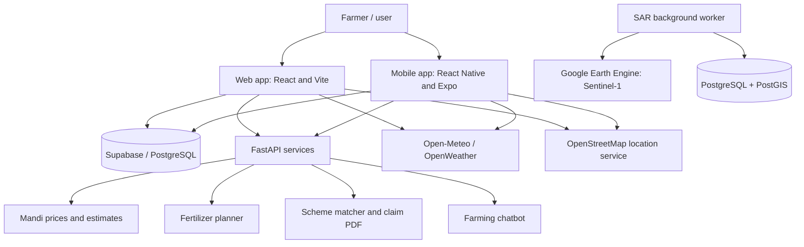
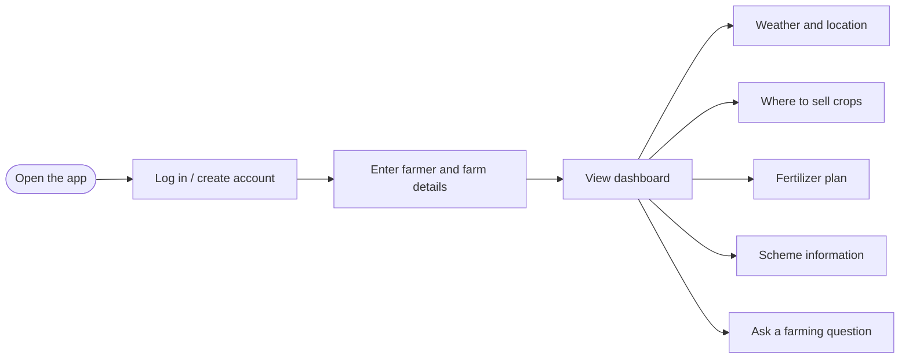
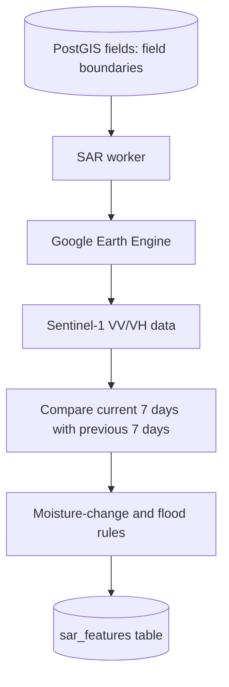

# Crop-Wise Project Summary (Simple English)

This document explains the Crop-Wise project in simple English: who it is for, what its parts do, how they work, and what is needed to run them. It describes what is present in the repository. Features that are optional, limited, or not fully production-ready are clearly identified.

## 1. Project at a glance

**Crop-Wise** is an agriculture support platform for farmers and project contributors. Its main web app provides weather information, suggestions on where to sell crops, fertilizer plans, and information about government schemes. The project also includes a mobile app, a farming chatbot, and a separate program for processing satellite (SAR) data about fields.

In simple terms:

> The farmer provides information → the app gets available weather and farming data → services prepare suggestions → the dashboard shows those suggestions.

The app provides information and assistance. It does not automatically apply for government schemes, approve insurance claims, or turn its suggestions into official government decisions.

## 2. Project overview diagram



**Note:** The web and mobile apps connect directly to some services, such as Supabase and weather/location providers. Mandi, fertilizer, schemes, and chatbot features need backend services. The SAR worker is a separate, optional data-processing program.

## 3. Typical user flow



Whether a farmer's profile or location is used by every feature depends on that feature's implementation and the information provided. Some APIs may need crop, land size, district, or location as separate inputs.

## 4. Main parts of the project

### A. Web application

**Location:** `client/`

- A browser-based app built with React 18 and Vite.
- Main path: login → registration → dashboard.
- Dashboard sections/tabs include overview, weather, mandi, advisory, fertilizer, schemes, alerts, and calendar.
- After login, a farmer can enter farmer and farm details in registration.
- A Kisan Mitra chatbot widget is also available for registered users.
- The web app includes code for Google translation widgets/APIs. Translation depends on network access and a correctly configured provider.

Main code: `client/src/App.jsx`, `client/src/pages/`, `client/src/components/`, and `client/src/lib/`.

### B. Mobile application

**Location:** `mobile/`

- A React Native app built with Expo.
- It has login/account, registration, and dashboard screens.
- The mobile dashboard includes weather and mandi features.
- The mobile app does not have the same set of screens as the web app. The inspected source does not show dedicated mobile screens for fertilizer, schemes, chatbot, or translation.
- The app may ask for device location permission to use location features.

Main code: `mobile/App.js`, `mobile/src/screens/`, `mobile/src/navigation/`, and `mobile/src/lib/`.

### C. Login and farmer profile

- Both web and mobile apps use a Supabase client.
- The source includes farmer profile/login and farm registration code.
- The initial database schema is in `docs/registration-table.sql`. It defines `farmers` and `registrations` tables and Row Level Security policies.
- The exact login/session approach can differ between the web and mobile implementations. Running the project requires a Supabase project, the required database schema, and correct environment values.
- `.env.sample` and `.env.example` contain blank/example values. Keep real credentials only in your local `.env`; never upload that file to GitHub.

### D. Weather

**Main code:** `client/src/lib/farmWeather.js`, `mobile/src/lib/farmWeather.js`

- The app tries to find the farm/village location and its coordinates.
- Open-Meteo can provide forecasts and air-quality information. This provider generally does not require an API key.
- OpenStreetMap Nominatim may be used for geocoding and reverse geocoding.
- There is also optional OpenWeatherMap configuration. Its features will not be available without a valid key.
- Accurate results depend on internet access, a correct location, and the availability of external providers.

### E. Mandi advice (Mandi Intelligence)

**Main code:** `AIML/mandi_intelligence/`

- The farmer provides inputs such as crop, quantity, and location/coordinates.
- The service looks at available mandis and price data.
- The code uses historical/local CSV data and price-prediction models for mandi/crop combinations. Model files are in `ml_arbitrage/models/`.
- Mandi options are ranked by estimated profit after costs such as distance/transport, storage, perishability, and traffic.
- A **live mandi data feed is not guaranteed**. A dataset in the repository does not, by itself, prove a real-time connection to AGMARKNET or another market feed.
- If forecasts or models are unavailable, estimates may be limited. Treat them as estimates, not guaranteed market prices.

### F. Fertilizer plan

**Main code:** `client/src/components/FertilizerAdvisor.jsx`, `AIML/ml/fertilizer_router.py`

- The planner uses inputs such as crop, season, land area, and district to suggest estimated amounts and a schedule for urea, DAP, and MOP.
- Server-side calculations use crop NPK baselines, soil/pH/irrigation information from the Gujarat district CSV, and available inputs such as NDVI and rainfall.
- This is a **rule/formula-based planner**. It is not a trained machine-learning model and does not use an actual laboratory soil test for the farmer's field.
- Incorrect district, crop, area, or estimated inputs can change the advice. Confirm important decisions with a local agriculture expert or a soil test.

### G. Government schemes and claim PDF

**Main code:** `AIML/scrapbot/src/`

- The service filters and scores scheme records using details such as the farmer's state and category.
- Scheme records are stored in `schemes_db.json`. The scraper code uses simulated/mock scraping behavior; this does not mean the app currently gets live information from every government portal. Check scheme rules on official government websites.
- The claim feature can create a PMFBY-style assessment/PDF from information provided by the farmer.
- The generated PDF is a helpful draft/form. It is not an official submission, verified damage assessment, or insurance approval. The claim must be submitted separately to the relevant government or insurance organization.

### H. Farming chatbot

**Main code:** `AIML/chatbot/main.py`, `client/src/components/ChatbotWidget.jsx`

- The user submits a farming question. The web app may send some previous conversation and available farmer context with it.
- The backend tries to get an answer from a configured OpenAI or Gemini provider. A provider API key and internet access may be required.
- Without a configured key/provider, a real AI answer may not be available.
- Do not treat chatbot responses as live mandi prices, government approvals, or guaranteed expert advice. The source does not ensure that live mandi, weather, or scheme data is automatically connected to chatbot answers.

### I. SAR satellite processing (separate/optional part)

**Location:** `sar_processing/`

SAR means Synthetic Aperture Radar. Satellite radar data can help observe some ground conditions, including when it is cloudy or dark. In this repository, SAR is processed by a separate worker.



- The worker reads field polygon boundaries from the database and requests Sentinel-1 (`COPERNICUS/S1_GRD`) data from Google Earth Engine.
- It calculates the difference between current and previous averages of VV/VH backscatter values.
- Rule-based thresholds classify moisture as `high`, `low`, or `normal`, and set a flood flag.
- Results are saved to the PostGIS `sar_features` table.
- This requires PostgreSQL/PostGIS, a database connection, and Google Earth Engine authentication/configuration.
- The SAR worker does not start automatically with the regular `npm run dev` command. The code also has a stub/fallback path if Earth Engine cannot provide real data; that output should not be considered live satellite analysis.

### J. Yield prediction and extra utilities

- The unified API includes a batch yield-prediction route that depends on an external Java model/configuration. Its default model path may point to a developer's computer and may need to be changed before it works elsewhere.
- The root scripts `generate_pdf.py`, `generate_srs_pdf.py`, and `generate_academic_srs_pdf.py` create documentation/PDF files; they are not runtime features of the main app.
- `docs/` contains database setup SQL. `AIML/` contains API, model, and data test scripts.

## 5. Backend and API services

**Main API:** `AIML/main.py` contains the FastAPI app that connects separate services. The root `package.json` starts AIML on port **8001**. Older README files or other configurations may mention port 8000; for local development, check the current `package.json` and Vite proxy settings.

Main routes (when the service is mounted/configured successfully):

| Route | Purpose |
|---|---|
| `GET /`, `GET /health` | Basic service status |
| `/mandi/...` | Mandi list, health, and recommendation APIs |
| `POST /mandi/response` | Mandi suggestions based on crop/quantity/location |
| `GET /chatbot/default-questions`, `POST /chatbot/ask` | Chatbot prompts and answers |
| `/schemes/...` | Scheme recommendations and claim PDF, if Scrapbot loads |
| `GET /api/fertilizer/recommend` | Fertilizer recommendation |
| `POST /yield/predict-batch` | Yield estimate from a configured external model |

The existence of a route in code does not mean its external API key, database, model, or required Python package is already configured.

## 6. Where the data and APIs come from

| Data or service | Source | Important note |
|---|---|---|
| Farmer profile/registration | Supabase/PostgreSQL | Set up a Supabase project and database schema |
| Weather/forecast | Open-Meteo; optional OpenWeatherMap | Open-Meteo generally needs no key; OpenWeatherMap does |
| Location/coordinates | OpenStreetMap Nominatim/device location | Internet/location permission and a correct address may be needed |
| Mandi prices/models | Local CSV and model files in the repository | A live market feed is not guaranteed |
| Fertilizer soil inputs | `AIML/ml/gujarat_districts.csv` and code rules | Data may be limited to Gujarat districts |
| Scheme list | `AIML/scrapbot/src/schemes_db.json` | Mock/curated data; verify on official sources |
| Chatbot response | Configured OpenAI or Gemini provider | Provider API key and internet may be required |
| Satellite SAR | Google Earth Engine Sentinel-1 | Authentication and PostGIS setup are required |
| Yield prediction | External Java model | Model path/runtime may need configuration |

## 7. Repository folder map

```text
Crop-Wise/
├── client/                 # React + Vite web app
├── mobile/                 # Expo + React Native mobile app
├── AIML/                   # FastAPI, mandi, fertilizer, schemes, chatbot
│   ├── mandi_intelligence/  # Mandi dataset, models, recommendation logic
│   ├── ml/                  # Fertilizer rules and district data
│   ├── scrapbot/            # Scheme matching and claim PDF
│   └── chatbot/              # AI chatbot API
├── sar_processing/         # Sentinel-1/GEE worker and PostGIS processing
├── docs/                   # Database setup/documentation files
├── .env.sample              # Example/placeholders for environment variables
├── package.json             # Main development/build commands
└── run-servers.bat          # Windows script to start local services
```

## 8. General steps to run locally

From the project root folder:

```powershell
Copy-Item .env.sample .env
# Now add your Supabase URL/key to the local .env file
npm install
npm run dev
```

According to the root scripts, `npm run dev` starts the web client and AIML service. The web app is normally at `http://localhost:5173` and the AIML service at `http://localhost:8001`. Install Python dependencies according to the AIML requirements/pyproject files. The mobile app and SAR worker have separate setup/commands; see their README files.

**Keep secrets safe:** Put your credentials in `.env`, and do not commit or upload it to the public repository. Share only placeholder files such as `.env.sample` or `.env.example`. Do not put API keys in chat, screenshots, or public code.

## 9. Current limitations and checks before deployment

1. The repository includes mandi price data, but a live external price feed is not guaranteed.
2. The scheme scraper does not guarantee real-time government data; verify details on official websites.
3. The claim PDF is a helpful draft, not an approved official claim.
4. Fertilizer advice uses rules and district data, not a laboratory soil test.
5. The chatbot and some optional services need separate provider keys and internet access.
6. SAR needs separate database and Earth Engine configuration; the regular web startup does not run it.
7. The mobile app, web app, and backend do not have identical features.
8. Some older README/setup details may differ from the actual scripts and ports. Check `package.json`, the Vite config, and the relevant module README for current run instructions.
9. Before public deployment, check environment variables, API CORS/proxy settings, Supabase policies, external API availability, and production build/deployment settings. Putting code on GitHub does not deploy the app by itself.

## 10. The whole project in one sentence

**Crop-Wise is a student-built agriculture platform that brings together web/mobile dashboards, weather, mandi advice, a fertilizer planner, scheme information, a chatbot, and optional satellite-based field analysis—but every feature should be checked with the correct data, external services, and configuration before being used for real farming or government decisions.**
